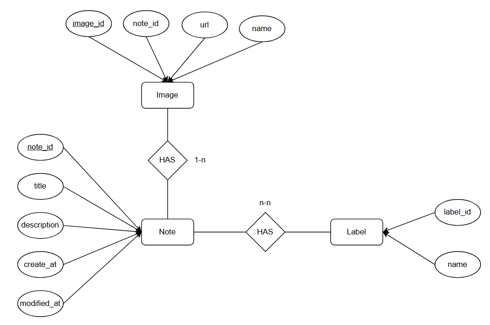
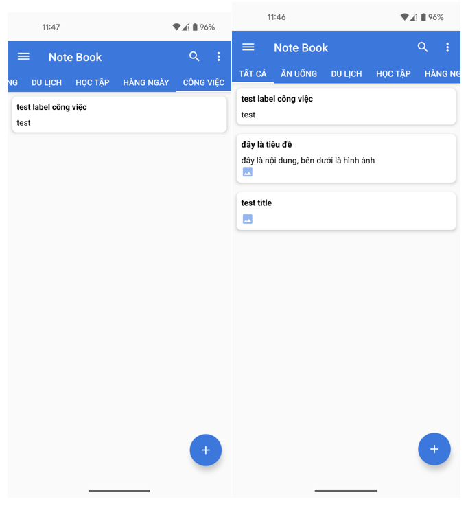

<h1> Notebook - Android </h1>
<h2> About this project</h2>
<h3> Project overview</h3>

This project is built to provide a solution to replace traditional paper note. No need to carry bulky notebook, just aa Android smartphone can take notes important anytime, anywhere, without internet connection. This app is designed based on MVVM (Model View ViewModel) model.

Compatibility: Android 13 and above

<h3> Features </h3>

- Display, add, edit, delete note
- Display, add, edit, delete label
- Display, add, edit, delete note's label
- Classify note by label
- Find note by keyword
- Support Vietnamese and English

<h3> Expected features in the future </h3>

- Attach images to note
- Format note content such as Bold, Italic, Underline
- Support dark and light theme
- Save data in the cloud server

<h3> Used tech stack </h3>

- MVVM model
- Room persistence library for database
- Multithreading using Executor and ExecutorService

<h3> ER model for database </h3>

<h3> Some screenshot </h3>

 

